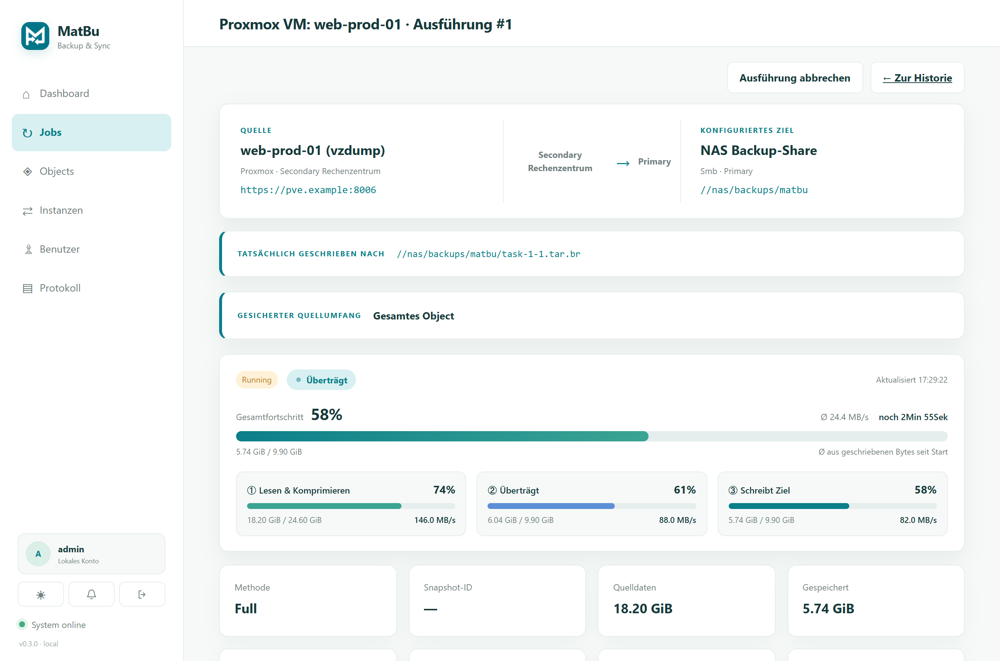
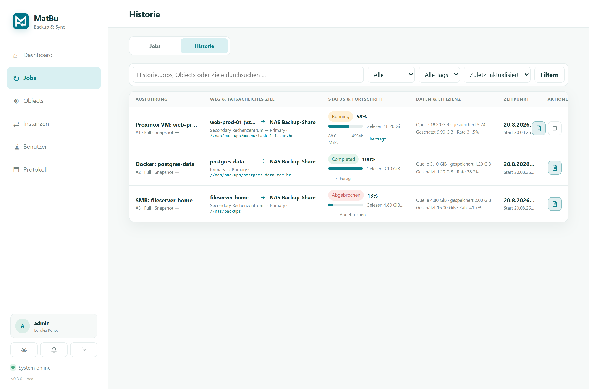

# MatBu

MatBu (Matthix + Backup) ist die Basis für einen robusten Backup- und Sync-Server mit Master-/Slave-Verbindungen über HTTPS.

Full-Archive erhalten eine SHA-256-Prüfsumme, die im Job gespeichert und bei Gateway-Transfers, lokalen Zielkopien sowie vor einem Restore erneut geprüft wird. Beschädigte oder unvollständige Transfers werden verworfen und über den vorhandenen Checkpoint-/Retry-Pfad neu übertragen.

## Screenshots



*Detailseite mit Gesamtfortschritt (%, Ø-Geschwindigkeit, Restzeit) und den drei Live-Pipeline-Stufen Lesen → Übertragen → Schreiben inkl. Abbrechen-Schaltfläche.*



*Historie/Liste mit Live-Balken, Geschwindigkeit und Zuständen (laufend, fertig, abgebrochen).*

## Starten

Die einfachste Production-Installation besteht aus einem Container für Oberfläche, Scheduler und Transfer-Worker:

```bash
docker compose -f docker-compose.production.yml up -d
```

Sie lädt `ghcr.io/real-ttx/matbu:latest`, veröffentlicht Port 9293 und speichert alle MatBu-Daten im Volume `matbu_matbu-data`. Für größere Installationen bleibt `docker-compose.release.yml` mit getrenntem Web-/Scheduler- und Worker-Container verfügbar.

```powershell
docker compose build
docker compose up -d
```

Die Oberfläche ist danach unter `http://localhost:9293` erreichbar. Die Daten liegen im Docker-Volume `matbu_matbu-data`.

Für einen produktionsnahen Release-Stack zuerst `.env.production.example` nach `.env.production` kopieren und die Netzwerk- und Proxy-Einstellungen prüfen.

```powershell
docker build -t matbu:latest .
docker compose --env-file .env.production -f docker-compose.release.yml up -d
```

Der Release-Stack bindet Port 9293 standardmäßig nur an `127.0.0.1`. Für Zugriffe aus anderen Netzen gehört davor ein HTTPS-Reverse-Proxy; die Secondary baut ihre Verbindung ausgehend zu dessen öffentlicher HTTPS-Adresse auf. `MATBU_TRUST_FORWARD_HEADERS=true` darf nur in diesem abgeschirmten Proxy-Aufbau verwendet werden. Wer MatBu bewusst direkt im LAN veröffentlicht, setzt `MATBU_BIND_ADDRESS=0.0.0.0` und `MATBU_TRUST_FORWARD_HEADERS=false`, hat dann aber ohne zusätzlichen TLS-Terminator keine verschlüsselte Webverbindung.

## Production-Secondary in einem entfernten Netzwerk

Auf der Primary unter **Instanzen → Secondary erstellen** nur Name und die von außen erreichbare Primary-Adresse eintragen. MatBu erzeugt das Instance-Token automatisch, speichert es verschlüsselt und zeigt anschließend ein vollständig ausgefülltes Production-Compose an. Dieses über **Compose herunterladen** als `docker-compose.yml` auf den entfernten Host übertragen und dort starten:

```bash
docker compose up -d
```

Das Compose lädt `ghcr.io/real-ttx/matbu:latest`; Quellcode, lokaler Build, `.env`-Datei und manuell erzeugte Tokens sind nicht erforderlich. `docker-compose.remote-secondary.yml` bleibt als manuell ausfüllbare Vorlage verfügbar. Das Token kann in der Primary auf der Setup-Seite bewusst erneuert werden; das bisherige Compose wird dadurch sofort ungültig.

Der GitHub-Workflow `.github/workflows/container.yml` veröffentlicht `:dev` vom Branch `dev` und `:latest` vom Branch `main`. Das GHCR-Package muss nach dem ersten Lauf einmalig öffentlich geschaltet werden, damit entfernte Hosts es ohne `docker login` laden können.

Die Secondary veröffentlicht keinen Port und benötigt keine eingehende Firewall-Regel. Sie verbindet sich ausschließlich ausgehend zu `MATBU_PRIMARY_ENDPOINT`; bei HTTPS normalerweise über TCP 443. Das Docker-Socket-Mount ist nur nötig, wenn Docker-Volumes dieses entfernten Hosts gesichert werden sollen. Den Verbindungsstatus sieht man auf der Primary unter **Instanzen** oder auf dem Remote-Host mit:

```bash
docker compose -f docker-compose.remote-secondary.yml logs -f secondary
```

Die Healthchecks prüfen `/health`. SQLite, Sitzungen, verschlüsselte Zugangsdaten und Data-Protection-Schlüssel liegen gemeinsam im lokalen Volume `matbu-data`. Dieses Volume muss selbst regelmäßig gesichert werden und darf nicht auf einem NFS-/SMB-Dateisystem betrieben werden. Vor einer Wiederherstellung des MatBu-Systemvolumes müssen Primary und Worker gestoppt sein.

Der Docker-Socket gewährt dem Container praktisch administrative Kontrolle über den Docker-Host; `:ro` begrenzt die Docker-API nicht. Der Mount ist für Docker-Volume-Backups und Container-Konsistenzsteuerung vorgesehen. MatBu deshalb nur auf einem dedizierten, vertrauenswürdigen Backup-Host betreiben und den Socket nicht an fremde Container weitergeben.

## Aktueller Stand

- Dashboard mit Aktivitätsübersicht und Systemstatus
- getrennte Bereiche für Tasks, Objects und Benutzer
- responsive Tabellen-/Toolbar-Grundlayout
- SQLite-Persistenz im Volume (`/data/matbu.db`) mit Tabellen für Objects, Tasks, Users und Sessions
- ASP.NET-Core-API für Summary, Tasks, Objects, Benutzer und Login-Startpunkt
- lokale Anmeldung mit PBKDF2-Passwort-Hashing und 12-Stunden-Session-Cookie im persistenten Store
- Hintergrund-Scheduler für aktivierte Tasks mit Intervallen bis zur Transfer-Engine
- Object-Typ `DockerVolume` als vorbereitete Backup-Quelle
- isolierter Docker-Volume-Worker mit read-only Socket-Mount und TAR-Archivierung
- SMB-Zielablage über einen im Worker gemounteten Share-Pfad mit Erreichbarkeitsprüfung
- nativer SMB-Upload über `smbclient` mit temporärer Auth-Datei im Worker
- 30-Sekunden-SMB-Timeouts und atomare `.partial`-Archivierung
- Dockerfile und Dev-/Release-Compose auf Port 9293
- serverseitige Razor Pages fuer Dashboard, Tasks, Objects, Benutzer und Jobs
- CI-Farbe `#0b7f8a` mit System/Hell/Dunkel-Darstellung
- Monitoring-Health-Endpunkt mit persistentem Admin-Token
- Full, Forward Incremental, Differential und Reverse Incremental mit SHA-256-Chunk-Katalogen
- Proxmox VE als Quelle mit API-Token, VM-/CT-Auswahl und `vzdump`-Snapshots
- Echtzeit-Job-Fortschritt: Gesamtbalken mit %, Ø-Speed und ETA sowie drei Pipeline-Stufen (Lesen/Übertragen/Schreiben) mit momentaner Geschwindigkeit – in Liste, Dashboard und Detailseite (1-2s-Polling)
- Transfer-Backpressure und Sparse-Cache begrenzen den Cache-Bedarf der Secondary auf den un-übertragenen Rückstand
- Free-Space-Guard auf den Primary-Empfangspfaden bricht kontrolliert ab, bevor der Cache-Datenträger vollläuft
- Direkt-ins-Ziel-Streaming für LocalFolder-Ziele: kein zweites vollständiges Cache-Duplikat auf der Primary (Footprint ~1× statt ~2×), Integrität via Zurücklesen + SHA-256
- Grazile Job-Abbrüche: laufende Ausführungen können abgebrochen werden (Zustand „Abgebrochen", kein Retry, Cleanup, Secondary-Abbruchsignal)
- parallele Quellgrößen-Ermittlung, damit %/ETA verfügbar sind, ohne den Transferstart zu blockieren

## Proxmox VE als Quelle

MatBu startet den nativen `vzdump`-Snapshot auf Proxmox und nimmt die entstandene VMA-/LXC-Datei anschließend in den normalen, wiederaufnehmbaren Backup-Transfer auf. Das funktioniert auch über eine Secondary: Die Secondary verbindet sich ausgehend mit der Primary, startet `vzdump` in ihrem Netz und überträgt nur über diese bestehende Verbindung.

Voraussetzungen:

- API-Token mit mindestens `VM.Backup` für die gewählten Gäste sowie Schreibrecht auf dem Proxmox-Storage
- ein Dump-Storage, dessen `dump`-Verzeichnis sowohl Proxmox als auch die ausführende MatBu-Instanz sehen
- der gemeinsame Dump-Pfad wird im MatBu-Container als `/proxmox-dump` gemountet

Beispiel für die Primary:

```powershell
$env:MATBU_PROXMOX_DUMP_PATH = "X:\proxmox-dump"
docker compose -f docker-compose.yml -f docker-compose.proxmox.yml up -d --build
```

Für eine Secondary wird entsprechend `docker-compose.secondary.yml` zusammen mit `docker-compose.secondary.proxmox.yml` verwendet. Das Object erhält diese Adresse:

```text
https://pve.example:8006/?node=pve-01&storage=matbu&path=/proxmox-dump&verifyTls=false
```

Als Benutzer wird die vollständige Token-ID wie `matbu@pve!backup`, als Passwort das Token-Secret gespeichert. `verifyTls=false` ist ausschließlich für selbstsignierte Testinstallationen gedacht. Der Object-Test prüft API, Token und den lokalen Dump-Mount. Nach erfolgreicher Aufnahme entfernt MatBu nur die von diesem Lauf erzeugte temporäre Dump-Datei.

## Backup-Methoden

- **Full:** jedes Mal ein eigenständiges Archiv; einfach, aber höchster Speicher- und Transferbedarf.
- **Forward Incremental:** vergleicht gegen den letzten Stand und überträgt nur neue SHA-256-Chunks.
- **Differential:** vergleicht jeden Lauf gegen die feste Baseline; ein Restore benötigt logisch nur Baseline und gewünschten Stand.
- **Reverse Incremental:** hält `current` als direkt lesbaren aktuellen Stand und versioniert ersetzte Chunks im Repository.
- **Proxmox Native (PBS):** PVE schreibt VM-Disks blockbasiert und Container dateibasiert direkt in einen bereits in PVE konfigurierten PBS-Storage. MatBu orchestriert und protokolliert den Lauf, liegt aber nicht im Datenpfad.

Alle blockbasierten Varianten verwenden 4, 8, 16 oder 32 MiB große Chunks, deduplizieren identische Inhalte und behalten Manifest, Parent, Baseline und Chain-Tiefe pro Snapshot. Bei Verbindungsabbruch bleiben geprüfte Chunks und Transfer-Checkpoints erhalten; der nächste Versuch setzt fehlende Daten fort.

### Native PBS-Konfiguration

Für native PVE→PBS-Jobs wird ein Ziel-Object vom Typ **Proxmox Backup Server** angelegt:

```text
https://pbs.example:8007/?datastore=main&pveStorage=pbs-main&namespace=customers/acme&verifyTls=false
```

`pveStorage` ist die Storage-ID, unter der derselbe PBS-Datastore bereits in PVE eingerichtet ist. Quelle und PBS-Ziel müssen derselben MatBu-Instanz zugeordnet sein. Bei einer Secondary startet diese den PVE-Task über ihre ausgehende Verbindung und sendet während langer Backups Heartbeats. Das PBS-Token benötigt Leserechte für Datastore-Status und Snapshots sowie die Berechtigung zum Entfernen abgelaufener Snapshots; das PVE-Token benötigt die Rechte zum Starten von `vzdump`. MatBu wendet die Task-Retention ausschließlich auf die nach dem Backup eindeutig katalogisierten Snapshots dieses Tasks an, überträgt diese Retention bei Bedarf über die ausgehende Secondary-Verbindung und protokolliert das Ergebnis im Job. Fremde Snapshots und ganze Backup-Gruppen werden nicht angetastet. Ein MatBu-Datei-Explorer für PBS-VM-Images wird erst angeboten, sobald der PBS-File-Restore vollständig integriert ist.

Secondary-Command-Payloads werden mit den persistenten Data-Protection-Schlüsseln verschlüsselt gespeichert. API-Token und SMB-Passwörter liegen dadurch auch während wartender oder wiederaufzunehmender Remote-Jobs nicht im Klartext in SQLite.

## Live-Fortschritt und Job-Abbruch

Laufende Jobs zeigen ihren Fortschritt in Echtzeit. Auf der Detailseite gibt es einen Gesamtbalken mit Prozent, durchschnittlicher Geschwindigkeit und geschätzter Restzeit (ETA) sowie drei getrennte Pipeline-Stufen – **Lesen & Komprimieren**, **Überträgt** und **Schreibt Ziel** – jeweils mit Prozent, Bytes und *momentaner* Geschwindigkeit (gleitendes Fenster statt Durchschnitt seit Start). Ein Phase-Badge zeigt den aktuellen Zustand, inklusive „Lesen pausiert – Übertragung langsam", wenn die Backpressure greift. Liste und Dashboard zeigen den Gesamtbalken samt Speed/ETA/Phase. Die Aktualisierung erfolgt per Polling (Liste/Dashboard alle 2 s, Detailseite jede Sekunde); ein laufendes Kommando meldet zusätzlich in kurzen Abständen Heartbeats, damit lange, aber lebende Transfers nicht fälschlich als abgebrochen gelten.

Die Quellgröße wird parallel zum Transfer ermittelt, sodass Lesen und Übertragen sofort starten und die Prozent-/ETA-Werte nachgeliefert werden, sobald die Größe feststeht (für LocalFolder-Quellen).

Laufende Ausführungen lassen sich über den Abbrechen-Button in Liste, Dashboard und Detailseite stoppen (Administratoren und Operatoren; nicht für reine Benutzer-Rollen). Ein Abbruch ist grazil: der Lauf endet im Zustand **Abgebrochen** ohne automatischen Retry, Teilartefakte (Quell-Cache, Ziel-Checkpoint, Konsistenz-Lease) werden aufgeräumt, und ein auf einer Secondary laufendes Kommando wird über den Fortschritts-Kanal ebenfalls abgebrochen. Der Abbruchwunsch wird persistiert und überlebt einen Worker-Neustart.

## Transfer-Cache und Backpressure

Beim Gateway-Streaming baut die Secondary das Quellarchiv in einen lokalen Transfer-Cache (`<data>/transfer-cache`) und überträgt es parallel. Eine **Backpressure** drosselt den Archiv-Build, wenn der noch nicht übertragene Rückstand eine Schwelle übersteigt, und bereits übertragene Cache-Bereiche werden per Sparse-File-Hole-Punching physisch freigegeben. Dadurch bleibt der Cache-Bedarf der Secondary nahe am Rückstand statt bei der vollen Archivgröße.

Auf den Primary-Empfangspfaden verhindert ein Free-Space-Guard, dass der Cache-Datenträger vollständig vollläuft: Unterschreitet der freie Platz die Sicherheitsreserve, wird der Transfer kontrolliert und wiederaufnehmbar abgebrochen statt mit einem harten „kein Speicherplatz"-Fehler.

Bei einem **LocalFolder-Ziel auf der Primary** schreibt der Empfang die eintreffenden Chunks jetzt **direkt in die Zieldatei**, ohne eine zweite vollständige Kopie im Transfer-Cache zu halten. Der Primary-Footprint entspricht damit 1× der Archivgröße (nur die Zieldatei) statt vormals ~2×; die Integrität wird durch erneutes Lesen und SHA-256-Prüfung der fertigen Zieldatei vor dem atomaren Umbenennen sichergestellt. Große VM-Archive laufen so auch dann durch, wenn der Transfer-Cache-Datenträger kleiner als das Archiv ist.

> **SMB-Ziele:** Für SMB-Ziele wird weiterhin über den Transfer-Cache übertragen (smbclient benötigt die vollständige lokale Datei). Wer den doppelten Footprint bei großen SMB-Zielen vermeiden möchte, bindet die Freigabe als CIFS-Mount ein und konfiguriert sie als `LocalFolder`-Ziel — damit greift automatisch der Direkt-ins-Ziel-Pfad.

Relevante Umgebungsvariablen:

| Variable | Standard | Wirkung |
| --- | --- | --- |
| `MATBU_TRANSFER_BACKLOG_HIGH_MIB` | 512 | Rückstand, ab dem der Archiv-Build pausiert wird |
| `MATBU_TRANSFER_BACKLOG_LOW_MIB` | 128 | Rückstand, bis zu dem gedrained wird, bevor der Build fortsetzt |
| `MATBU_TRANSFER_SPARSE_CACHE` | an | `0` deaktiviert das Hole-Punching des Transfer-Caches |
| `MATBU_MIN_FREE_SPACE_GIB` | 1/20 der Platte (512 MiB–5 GiB) | Sicherheitsreserve für Free-Space-Guard und Archiv-Build |
| `MATBU_TRANSFER_CACHE_RETENTION_HOURS` | 168 (7 Tage) | Aufbewahrung verwaister Transfer-Cache-Dateien |
| `MATBU_SECONDARY_COMMAND_IDLE_TIMEOUT_SECONDS` | 120 | Idle-Timeout eines Secondary-Kommandos ohne Fortschritt |
| `MATBU_SECONDARY_HEARTBEAT_SECONDS` | 10 | Keepalive-Intervall während langer Build-/Schreibphasen |
| `MATBU_SECONDARY_BUILD_STALL_SECONDS` | 1800 | Obergrenze ohne beobachtbaren Fortschritt, bevor der Watchdog greift |

## Monitoring-API

Nach Admin-Login kann das Token ueber `GET /api/monitoring/token` abgerufen werden. Der Health-Endpunkt ist anschliessend ohne Session-Cookie nutzbar:

```http
GET /api/monitoring/health
X-MatBu-Token: <monitoring-token>
```

Der Endpunkt antwortet mit `200 Healthy`, wenn alle Objects erreichbar sind, kein Task aktuell im Fehlerzustand steht und innerhalb der letzten 24 Stunden kein Job fehlgeschlagen ist. Bei Problemen wird `503 Degraded` mit den betroffenen Objects, Tasks und der Anzahl aktueller Jobfehler geliefert. Ein Admin kann das Token mit `POST /api/monitoring/token/regenerate` rotieren. Das Token liegt persistent im Volume unter `/data/monitoring.token`.

## Benachrichtigungen

Unter **Benutzer → Benachrichtigungen** oder über das Glocken-Symbol können Administratoren Webhook- und SMTP-Benachrichtigungen konfigurieren und getrennt testen. MatBu kann erfolgreiche und fehlgeschlagene Backup- sowie Restore-Jobs melden. Webhooks erhalten JSON mit Job, Route, Größen, Ziel und Fehlerdetails. Zustellungen werden in SQLite protokolliert, bei Fehlern bis zu dreimal wiederholt und nach einem Container-Neustart nicht doppelt versendet. Das SMTP-Passwort wird verschlüsselt in `/data/notifications.json` gespeichert; die Data-Protection-Schlüssel liegen ebenfalls im persistenten Volume.

## Anwendungskonsistente Docker-Backups

Full-Jobs können optional Docker-Container nur während der lokalen Quellaufnahme pausieren oder Pre-/Post-Kommandos über `/bin/sh -c` innerhalb eines Containers ausführen. Bei einer Quelle auf einer Secondary wird die Konsistenzsteuerung dort lokal ausgeführt; die Anwendung ist vor der anschließenden Übertragung bereits wieder freigegeben. Jeder Schritt erscheint im Jobprotokoll. Aktive Leases werden verschlüsselt im jeweiligen Datenvolume gespeichert und nach einem Worker- oder Secondary-Neustart automatisch bereinigt, damit pausierte Anwendungen und Post-Hooks wieder freigegeben werden. Die Konfiguration ist Administratoren vorbehalten; Kommandotexte werden nicht in die Jobhistorie kopiert.

## Zugang und Produktionshinweise

Bei einer neuen Development- oder Produktionsdatenbank lautet der initiale lokale Zugang `admin` / `admin`. Das Passwort kann später in der Benutzerverwaltung geändert werden. Anmeldeversuche sind auf fünf Versuche pro Minute und Quell-IP begrenzt. Sessions bleiben über Container-Neustarts erhalten, weil Datenbank und Data-Protection-Schlüssel im persistenten Volume liegen.

Vor der Freigabe müssen mindestens ein erfolgreicher Backup- und Restore-Lauf pro tatsächlich eingesetztem Object-Typ durchgeführt werden. Für Proxmox VE und PBS benötigt dieser Test echte Testendpunkte und API-Token; reine Unit-Tests ersetzen diesen Infrastrukturtest nicht.

## Tests

Die schnellen Kernlogik-Tests laufen mit:

```powershell
dotnet test tests/MatBu.Tests/MatBu.Tests.csproj
```

Der isolierte End-to-End-Lauf baut Primary, Worker und Secondary neu, verwendet Port `9294`, prüft Gateway-Backup, Secondary-Ausfall, Wiederaufnahme sowie Docker-Pause-Cleanup und entfernt danach nur seine eigenen Volumes:

```powershell
powershell -ExecutionPolicy Bypass -File tests/e2e/Run-MatBuE2E.ps1
```
